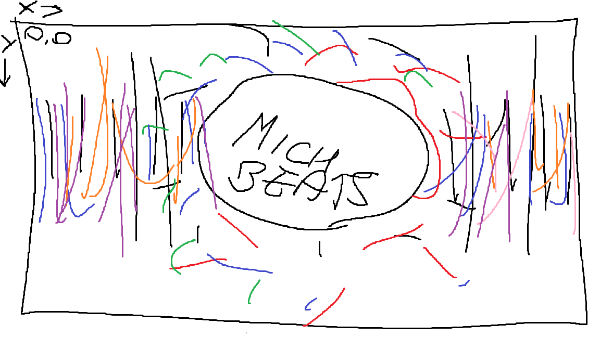

# Music Visualiser Project

Name:

Student Number: C19434762

## Instructions
- Fork this repository and use it a starter project for your assignment
- Create a new package named your student number and put all your code in this package.
- You should start by creating a subclass of ie.tudublin.Visual
- There is an example visualiser called MyVisual in the example package
- Check out the WaveForm and AudioBandsVisual for examples of how to call the Processing functions from other classes that are not subclasses of PApplet

# Description of the assignment
For this assignment I was required to create my own version of an audio visualiser, I created a music visualiser for this project, something that one can watch while listening to music.

# Instructions

# How it works
I created varius classes which were then called in MyVisual.

1) Ball
2) BallAmp
3) Circles
4) Cube
5) Waveform

# Ball
The balls are in an array which creates the background images of the stars(blue), their movement is based off the beat or amplitude of the song ( when the beat switches the amplitude inverses) and bounce off the sides of canvas.
```Java
   void display()
    {
        b.strokeWeight(0.85f);
        b.stroke(b.color(50,  150 + (500 * b.getAmplitude()),200));

        float size = 1.5f + (40 * b.getSmoothedAmplitude()); // size of circle

        b.circle(x,y,size);

    }
```
This code draws the cirlce at the end of the class.

# BallAmp
The balls are in an array which creates the background image of the stars(pink), they work the same way as the balls above however they remain invisble until the amplitude increases, this is done by * the transparency by the ampltitude.
```Java
   void display()
    {
        ba.strokeWeight(6.75f);
        ba.stroke(ba.color(255,  0,200, 0.0001f + ba.getAmplitude()* 700));
```

# Cube
The cubes spawn at a negative z location whilst rotating and flying towards their maximum z value. They change size, color and transparency based on amplitude.
```Java
 void display()
        {
            n.fill(PApplet.map(n.getAmplitude() * 255, 0, 255, n.fBase, n.fSet), 255, 255, n.getAmplitude() * 250);
        
            n.stroke(n.color(255,  100 - (500 * n.getAmplitude())));
            n.strokeWeight(1 + (n.getAmplitude() * 10));
            n.pushMatrix();
            n.translate(x, y, z);

            
            sumRotX += n.getAmplitude() * (rotX / 5);
            sumRotY += n.getAmplitude() * (rotY / 5);
            sumRotZ += n.getAmplitude() * (rotZ / 5);


            n.rotateX(sumRotX);
            n.rotateY(sumRotY);
            n.rotateZ(sumRotZ);
            float boxSize = 100 + (200 * n.getSmoothedAmplitude());
            n.box(boxSize);
            n.popMatrix();


            z += ((maxZ * n.getAmplitude()) * 0.4f) + 1;
            if (z >= maxZ)
            {
                z = startingZ;
            }
        }
```
# WaveForm
The waveform was by far the trickiest to get right, but it also turned out the best in my opinion. There are two lines, and one of them is inversed, the waveform is essentially created of two parts. The lines dimensions and colors vary depending on the amplitude of the song.
```Java
public void render()
        {
            wf.strokeWeight(0.1f);
            wf.colorMode(PApplet.HSB);

            for(int i = 0 ; i < wf.getAudioBuffer().size(); i ++) // draws waveform
            {
                wf.stroke(
                        PApplet.map(i, 0, wf.getAudioBuffer().size(), 0, 255)
                        , 255
                        , 255
                );

                float smoothedAmplitude = wf.calculateAverageAmplitude();
                smoothedAmplitude = PApplet.lerp(wf.getAudioBuffer().get(i), smoothedAmplitude, 0.35f);

                wf.line(i, cy, i+130, cy + cy * smoothedAmplitude); // waveform right
                wf.line(i*-1, cy, i*-1-130, cy + cy * smoothedAmplitude); // waveform left inverse

            }
        }
```
# What I am most proud of in the assignment
I'm very proud of all parts of the assignment, however I'm most proud of the visualiser as a whole that I created in the end. At the start of the project I designed a visualiser on paint that I wanted to re-create and it turned out ten times better than I would've ever expected. I'm very proud of the waveform I created and the background shifting in between the blue and blue + pink stars.



Here's a photo the visualiser I created initally at the start of the project on paint.

Here's a youtube link to a video of the visualiser in action.
[![YouTube]](https://www.youtube.com/watch?v=whW8aGy2UkI)
